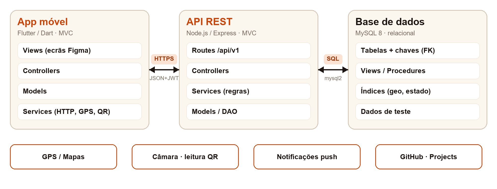
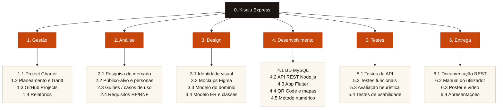
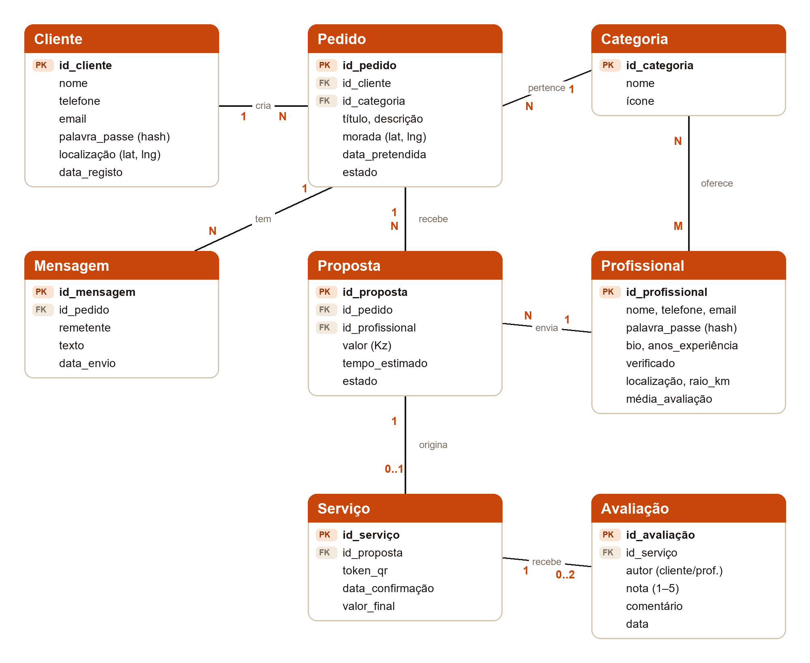
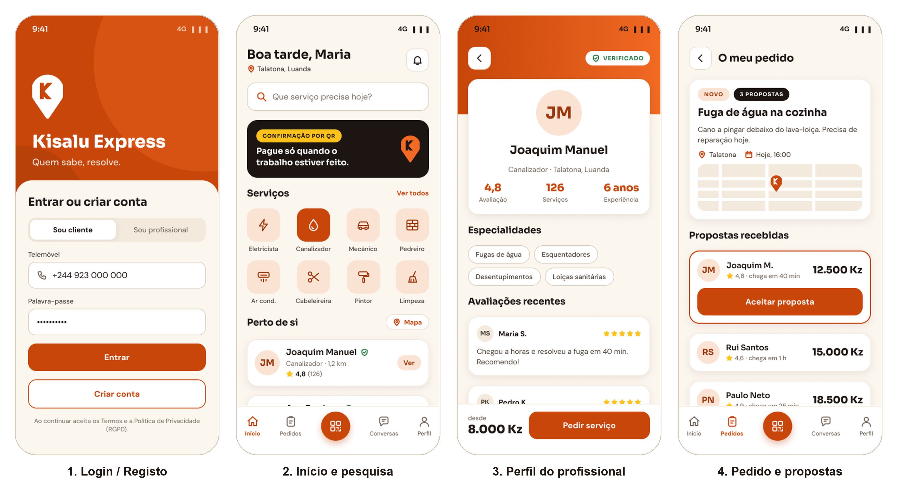
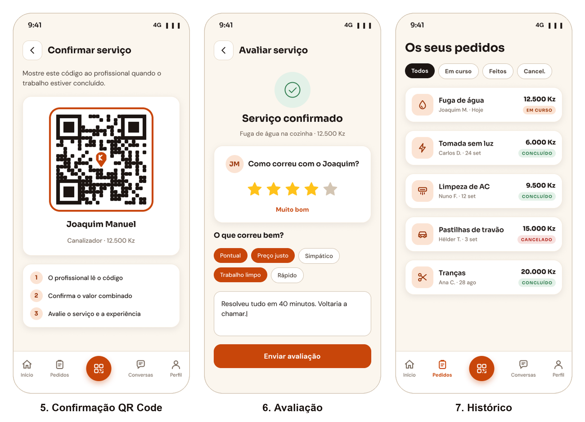
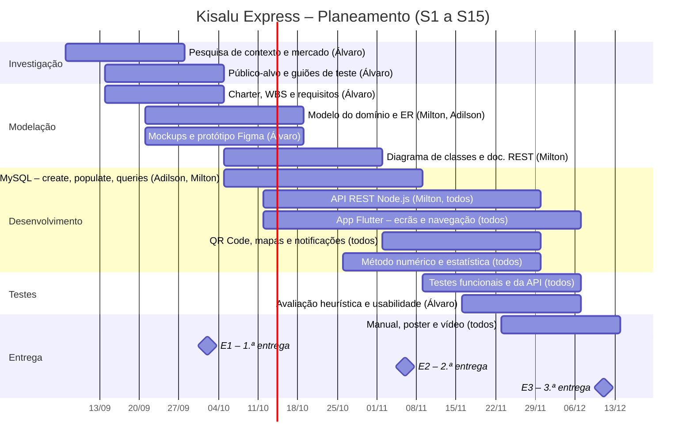

# Kisalu Express — Proposta de Projeto (v1)

**Marketplace móvel de serviços informais em Angola** · Projeto Multidisciplinar Mobile · 1.ª Entrega

📄 Versão PDF: [g05-proposta-v1.pdf](g05-proposta-v1.pdf)

---

## 1. Identificação

| | |
|---|---|
| **Universidade** | Universidade Europeia |
| **Faculdade** | IADE – Faculdade de Design, Tecnologia e Comunicação |
| **Curso / UC** | Licenciatura em Engenharia Informática · Projeto de Desenvolvimento Móvel |
| **Grupo** | Grupo 05 · Turma D02 |
| **Elementos** | Álvaro da Silva – 20252049 Adilson Yango – 20252312 Milton Malavo – 20252099 |
| **Projeto** | Kisalu Express |
| **Repositório GitHub** | <https://github.com/Eng-Infomatica-IADE/Kisalu-Express> |
| **Figma** | [Kisalu Express — Mockups (G05)](https://www.figma.com/design/y6x5pO2mwQpoiF5ep18mSl/Kisalu-Express-%E2%80%94-Mockups--G05-?node-id=1-2&t=GXQBKLtBISj0Al7r-1) |
| **Data** | 2 de outubro de 2026 |

## 2. Palavras-chave

Marketplace de serviços; economia informal; biscateiros; Angola; Flutter; API REST; MySQL; geolocalização; QR Code; avaliação de reputação.

## 3. Descrição da App e problema a resolver

A **Kisalu Express** é uma aplicação móvel que liga clientes a prestadores de serviços informais – os “biscateiros” – como eletricistas, canalizadores, mecânicos, pedreiros, técnicos de ar condicionado ou cabeleireiras. O nome junta “kisalu” (trabalho, em kimbundu) a “express”, traduzindo a promessa da marca: **“Quem sabe, resolve.”**

Em Angola, grande parte destes serviços é contratada por recomendação boca-a-boca, grupos de WhatsApp ou na rua. O cliente não sabe em quem confiar nem quanto vai pagar; o profissional depende da sorte para ter trabalho e não consegue provar a qualidade do que faz. A economia informal representa a maioria do emprego em África (cerca de 85,8 %, segundo a OIT), mas continua quase invisível no digital.

A app resolve estes problemas com **perfis de cliente e de profissional**, **pedidos e propostas com preço combinado**, **localização** dos profissionais mais próximos, **avaliações** após cada serviço e **confirmação do serviço por QR Code**, que regista de forma inequívoca que o trabalho foi concluído.

## 4. Objetivos e motivação

**Motivação.** Os elementos do grupo conhecem de perto a realidade angolana, onde encontrar um profissional de confiança é difícil e onde muitos trabalhadores qualificados não têm forma de chegar a novos clientes. O projeto permite aplicar as competências do semestre a um problema real e com impacto social.

Objetivos do trabalho:

- Desenvolver uma app Flutter multiplataforma com perfis de cliente e de profissional.
- Implementar o ciclo completo pedido → proposta → serviço → confirmação por QR Code → avaliação.
- Disponibilizar pesquisa por categoria e por proximidade (GPS e mapa).
- Construir uma API REST em Node.js e uma base de dados relacional MySQL, documentadas.
- Garantir usabilidade (avaliação heurística e testes com utilizadores) e conformidade com o RGPD.

## 5. Público-alvo

| Segmento | Perfil | Necessidade principal |
|---|---|---|
| **Clientes** | Famílias e pequenos negócios em Luanda e capitais de província, 20–55 anos, com smartphone Android. | Encontrar rapidamente um profissional de confiança, perto, com preço claro. |
| **Profissionais (biscateiros)** | Trabalhadores independentes, 18–60 anos, literacia digital básica a média, uso intenso de WhatsApp. | Mais clientes, rendimento regular e reputação visível. |

A interface privilegia linguagem simples, ícones claros, poucos passos por tarefa e bom desempenho em equipamentos de gama baixa e redes móveis instáveis.

## 6. Pesquisa de mercado

| Aplicação | Mercado | Pedido + propostas | Perfis verificados | Confirmação de serviço | Foco no informal |
|---|---|---|---|---|---|
| **TaskRabbit** | EUA, Europa | Não (preço/hora) | Sim | Na app | Não |
| **Thumbtack** | EUA | Sim | Parcial | Não | Não |
| **Fixando** | Portugal | Sim | Parcial | Não | Não |
| **GetNinjas** | Brasil | Sim (pago por lead) | Parcial | Não | Parcial |
| **Grupos WhatsApp / Facebook** | Angola | Informal | Não | Não | Sim |
| **Kisalu Express** | Angola | Sim | Sim | QR Code | Sim |

Nenhuma das soluções analisadas está adaptada ao contexto angolano (kwanzas, moradas pouco normalizadas, profissionais sem presença digital). O diferencial da Kisalu Express é combinar **propostas com preço fechado**, **reputação verificável** e **confirmação presencial por QR Code**, que dá segurança às duas partes.

## 7. Guiões de teste (versão preliminar)

### 7.1 Caso core – Pedir um serviço e confirmar por QR Code

**Ator:** Maria (cliente). **Pré-condição:** sessão iniciada e localização ativa.

1. A Maria abre a app e, no ecrã Início, escolhe a categoria **Canalizador**.
2. Toca em **Pedir serviço**, descreve “Fuga de água na cozinha”, adiciona uma foto, confirma a morada (Talatona) e a data pretendida.
3. O pedido é publicado e os canalizadores num raio de 10 km recebem uma notificação.
4. Em poucos minutos recebe três propostas, com preço em kwanzas, tempo de chegada e avaliação de cada profissional.
5. Compara as propostas, abre o perfil do Joaquim Manuel (4,8 ★, verificado) e toca em **Aceitar proposta** (12.500 Kz).
6. O pedido passa a **Em curso**; a Maria acompanha a chegada no mapa e troca mensagens com o profissional.
7. Concluído o trabalho, a Maria abre **Confirmar serviço** e mostra o QR Code.
8. O Joaquim lê o código com a sua app; o serviço fica **Concluído** com o valor combinado.
9. A app pede à Maria que avalie o serviço (estrelas e comentário).

### 7.2 Caso 2 – Registo e verificação de um profissional

**Ator:** Joaquim (profissional).

1. Instala a app e escolhe **Sou profissional**.
2. Regista-se com o número de telemóvel e valida-o com um código SMS.
3. Preenche o perfil: fotografia, categorias (Canalizador), anos de experiência, zona de atuação e raio de deslocação.
4. Carrega o documento de identificação para obter o selo **Verificado**.
5. Ativa a disponibilidade e passa a receber pedidos da sua zona, aos quais pode responder com uma proposta.

### 7.3 Caso 3 – Consultar histórico e avaliar um serviço

**Ator:** Maria (cliente), após o caso core.

1. Abre o separador **Pedidos** e filtra por **Concluídos**.
2. Seleciona “Fuga de água na cozinha” e vê o resumo: profissional, valor, data e comprovativo da confirmação por QR.
3. Toca em **Avaliar**, atribui 4 estrelas, marca “Pontual” e “Preço justo” e escreve um comentário.
4. Envia a avaliação; a média do Joaquim é recalculada e mostrada no seu perfil.
5. Toca em **Pedir de novo** para repetir o serviço com o mesmo profissional.

## 8. Descrição da solução a implementar

### i. Descrição genérica da solução

Sistema cliente-servidor composto por uma **app móvel Flutter** (cliente e profissional na mesma app, com perfis distintos), uma **API REST** em Node.js que concentra a lógica de negócio e uma **base de dados relacional MySQL**. A app usa o GPS para pesquisa por proximidade, a câmara para leitura de QR Code e notificações push para alertar sobre novos pedidos e propostas.

### ii. Enquadramento nas Unidades Curriculares

| Unidade Curricular | Contribuição para a Kisalu Express |
|---|---|
| **Projeto de Desenvolvimento Móvel** | Gestão ágil (GitHub Projects), planeamento, documentação, apresentações. |
| **Programação de Dispositivos Móveis** | App Flutter/Dart (MVC), servidor Node.js REST, integração com a BD, Git e documentação REST. |
| **Bases de Dados** | Modelo ER, base de dados MySQL, scripts create/populate/queries e BD exemplo com dados fictícios. |
| **Redes e Comunicação de Dados** | Arquitetura cliente-servidor, HTTPS, autenticação por token e comunicação app–API. |
| **Interfaces e Usabilidade** | Pesquisa de utilizador, personas, style guide (identidade visual), mockups em Figma, avaliação heurística e testes de usabilidade. |
| **Matemática Discreta** | Método de Monte Carlo para estimar o tempo de chegada do profissional; estatística descritiva (média, desvio-padrão) para sugerir intervalos de preço por categoria e calcular a reputação. |

### iii. Requisitos técnicos

- App em **Flutter 3 / Dart**, desenvolvida em Android Studio ou VS Code; alvo Android 8.0+ (iOS opcional).
- Arquitetura **MVC** no frontend e no backend; código separado em módulos (models, views, controllers, services, data access).
- Servidor **Node.js + Express** com API REST em JSON, documentada segundo o formato Bocoup.
- Base de dados **MySQL 8** relacional; dados de desenvolvimento fictícios.
- Permissões do dispositivo: localização (GPS), câmara (QR Code), notificações e acesso a fotografias.
- Comunicação por HTTPS; autenticação com JWT; palavras-passe com hash (bcrypt).
- Gestão de versões em **GitHub** e de tarefas em **GitHub Projects**; mockups em **Figma**.

### iv. Arquitetura da solução (provisória)

*Figura 1 – Arquitetura cliente-servidor em três camadas.*

### v. Tecnologias a utilizar (provisório)

| Camada | Tecnologias |
|---|---|
| **Mobile** | Flutter, Dart, http/dio, provider, geolocator, google_maps_flutter, mobile_scanner, qr_flutter, firebase_messaging |
| **Backend** | Node.js, Express, mysql2, jsonwebtoken, bcrypt |
| **Dados** | MySQL 8, MySQL Workbench |
| **Design** | Figma (mockups e protótipo), identidade visual Kisalu Express |
| **Gestão** | Git, GitHub, GitHub Projects, Markdown |

### vi. Project Charter

| | |
|---|---|
| **Objetivo** | Entregar até 11.12.2026 uma app móvel funcional que ligue clientes a profissionais informais em Angola, com confirmação de serviço por QR Code. |
| **Âmbito (inclui)** | Registo e perfis; pesquisa por categoria e proximidade; pedidos e propostas; mensagens; confirmação por QR Code; avaliações; histórico; API REST; BD MySQL; documentação. |
| **Fora de âmbito** | Pagamentos reais integrados, versão web, painel de administração completo, publicação nas lojas. |
| **Stakeholders** | Equipa do projeto (G05); docentes das UCs envolvidas; clientes e profissionais (utilizadores finais). |
| **Restrições** | Prazo semestral com três entregas (02.10, 06.11 e 11.12.2026); tecnologias obrigatórias (Flutter, Node.js, MySQL, GitHub, Figma); dados fictícios; RGPD. |
| **Premissas** | Utilizadores com smartphone Android e acesso a dados móveis; disponibilidade das APIs de mapas e notificações em modo gratuito. |
| **Critérios de sucesso** | Caso core executado de ponta a ponta no telemóvel; todos os RF “Must” implementados; avaliação heurística sem problemas graves; entregas dentro do prazo. |
| **Principais riscos** | Curva de aprendizagem de Flutter (mitigação: protótipos cedo); integração app–API–BD (contratos REST definidos cedo); âmbito excessivo (priorização MoSCoW); segurança dos dados (JWT, hash, RGPD). |

### vii. WBS – Work Breakdown Structure

### viii. Requisitos funcionais e não funcionais

| ID | Requisito funcional | Prioridade |
|---|---|---|
| RF01 | Registar e autenticar utilizadores (cliente ou profissional) com telemóvel e palavra-passe. | Must |
| RF02 | Gerir o perfil do profissional: categorias, experiência, zona de atuação e documentos de verificação. | Must |
| RF03 | Pesquisar profissionais por categoria e por proximidade, em lista e em mapa. | Must |
| RF04 | Criar um pedido de serviço com descrição, fotografia, localização e data. | Must |
| RF05 | Enviar, consultar, aceitar e recusar propostas com valor em kwanzas e tempo estimado. | Must |
| RF06 | Gerar e ler o QR Code que confirma a conclusão do serviço. | Must |
| RF07 | Avaliar o serviço (1 a 5 estrelas e comentário) e calcular a reputação do profissional. | Must |
| RF08 | Consultar o histórico de pedidos e o respetivo estado. | Should |
| RF09 | Trocar mensagens entre cliente e profissional no contexto de um pedido. | Should |
| RF10 | Receber notificações de novos pedidos, propostas e alterações de estado. | Should |
| RF11 | Marcar profissionais como favoritos e repetir pedidos. | Could |

| ID | Requisito não funcional |
|---|---|
| RNF01 | Usabilidade: tarefas principais em 5 passos ou menos; alvos de toque de 48 dp; contraste WCAG AA. |
| RNF02 | Desempenho: respostas da API em menos de 2 s em rede 4G; app fluida em equipamentos de gama baixa. |
| RNF03 | Segurança: HTTPS, autenticação JWT, palavras-passe com hash e token de QR de uso único. |
| RNF04 | Privacidade: tratamento de dados pessoais conforme o RGPD (consentimento, minimização, eliminação de conta). |
| RNF05 | Compatibilidade: Android 8.0 ou superior, ecrãs de 5 a 7 polegadas. |
| RNF06 | Manutenibilidade: arquitetura MVC, código modular, versionado em Git e documentado. |
| RNF07 | Disponibilidade: tratamento de falhas de rede com mensagens claras e nova tentativa. |

### ix. Modelo do domínio

O domínio organiza-se em torno do **Pedido**: um cliente cria pedidos numa categoria; cada pedido recebe propostas de profissionais; a proposta aceite origina um serviço, confirmado por QR Code e avaliado por ambas as partes.

*Figura 2 – Modelo do domínio: entidades, atributos principais e cardinalidades.*

### x. Mockups e interfaces

Os ecrãs principais foram desenhados em Figma com a identidade visual da marca (Laranja Kisalu #C8460A, Ébano #1C1512, tipografia Sora e DM Sans, ícones de traço). A navegação inferior coloca o QR Code ao centro, por ser a ação que distingue a app.

*Figura 3 – Login/registo, pesquisa de biscateiros, perfil e pedido/propostas.*

*Figura 4 – Confirmação por QR Code, avaliação e histórico.*

| Ecrã | Função |
|---|---|
| **Login / Registo** | Entrada por telemóvel e palavra-passe; escolha do perfil cliente ou profissional. |
| **Início e pesquisa** | Pesquisa livre, categorias com ícones e profissionais próximos com avaliação. |
| **Perfil do profissional** | Selo de verificação, estatísticas, especialidades, avaliações e botão “Pedir serviço”. |
| **Pedido / propostas** | Detalhe do pedido com mapa e comparação de propostas; uma ação principal por cartão. |
| **Confirmação por QR** | Código com moldura da marca e instruções em três passos. |
| **Avaliação** | Estrelas, etiquetas rápidas e comentário. |
| **Histórico** | Lista de pedidos filtrável por estado (em curso, concluído, cancelado). |

## 9. Planeamento e calendarização

O projeto segue uma metodologia ágil com sprints de duas semanas geridos em GitHub Projects. O semestre tem 15 semanas (S1 = 7 a 11 de setembro de 2026); os marcos coincidem com as entregas de 2 de outubro (E1), 6 de novembro (E2) e 11 de dezembro (E3).

**Distribuição de tarefas.** Todos os elementos participam em todas as frentes do projeto; cada um assume a responsabilidade principal de uma área:

- **Álvaro da Silva** – coordenação geral do projeto; UX/UI e prototipagem em Figma, incluindo testes de usabilidade; desenvolvimento em Node.js e Flutter/Dart.
- **Milton Malavo** – back-end (Node.js e integração da API REST) e modelação da base de dados, em conjunto com o Adilson; desenvolvimento em Node.js e Flutter/Dart.
- **Adilson Yango** – modelação e administração da base de dados MySQL (create, populate, queries), em conjunto com o Milton; desenvolvimento em Node.js e Flutter/Dart.

O desenvolvimento em Node.js e Flutter/Dart é partilhado pelos três elementos, com divisão por módulos ou funcionalidades em cada fase.

## 10. Conclusão

A Kisalu Express responde a uma necessidade concreta do mercado angolano: tornar a contratação de serviços informais simples, transparente e segura. A proposta define o problema, o público-alvo, os casos de utilização, os requisitos, o modelo do domínio, a arquitetura e os mockups que orientam o desenvolvimento.

Objetivos a atingir:

- **E2 (06.11.2026):** protótipo alfa com BD MySQL, API REST funcional e app a consumir os serviços (registo, pesquisa e pedidos).
- **E3 (11.12.2026):** app completa no telemóvel, com propostas, confirmação por QR Code, avaliações, histórico e notificações; documentação, manual, poster e vídeo.
- Validar a usabilidade com utilizadores reais dos dois perfis e cumprir integralmente o RGPD.

## 11. Bibliografia

- Bocoup. (2013). *Documenting your API*. https://bocoup.com/blog/documenting-your-api
- Express. (2026). *Express – Node.js web application framework*. https://expressjs.com
- Fixando. (2026). *Fixando – Encontre profissionais*. https://fixando.pt
- GetNinjas. (2026). *GetNinjas*. https://www.getninjas.com.br
- Google. (2026). *Flutter documentation*. https://docs.flutter.dev
- International Labour Organization. (2018). *Women and men in the informal economy: A statistical picture* (3rd ed.). ILO.
- ISO/IEC. (2015). *ISO/IEC 18004:2015 – QR Code bar code symbology specification*. ISO.
- Nielsen, J. (1994). *10 usability heuristics for user interface design*. Nielsen Norman Group. https://www.nngroup.com/articles/ten-usability-heuristics/
- Oracle. (2026). *MySQL 8.0 reference manual*. https://dev.mysql.com/doc/
- OpenJS Foundation. (2026). *Node.js documentation*. https://nodejs.org/docs
- Project Management Institute. (2021). *A guide to the project management body of knowledge (PMBOK guide)* (7th ed.). PMI.
- Regulamento (UE) 2016/679 do Parlamento Europeu e do Conselho, de 27 de abril de 2016 (Regulamento Geral sobre a Proteção de Dados).
- Sommerville, I. (2016). *Software engineering* (10th ed.). Pearson.
- TaskRabbit. (2026). *TaskRabbit*. https://www.taskrabbit.com
- Thumbtack. (2026). *Thumbtack*. https://www.thumbtack.com
- Universidade Europeia. (2026). *Projeto Mobile – Project Briefing (L-EI)*, 2026-2027, 3.º semestre.
