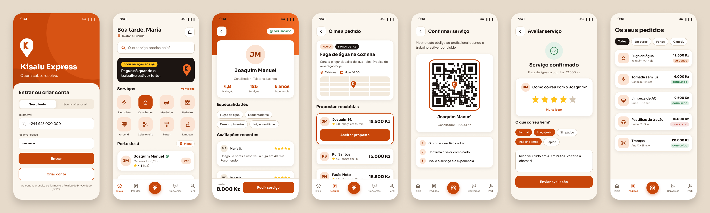

<b>Quem sabe, resolve.</b>

# Kisalu Express

## Documentação

| Documento | Markdown | PDF |
|---|---|---|
| Proposta inicial (1.ª entrega) | [g05-proposta-v1.md](Documentos/g05-proposta-v1.md) | [g05-proposta-v1.pdf](Documentos/g05-proposta-v1.pdf) |
| Segunda proposta | – | – |
| Relatório intermédio (2.ª entrega) | – | – |
| Relatório final (3.ª entrega) | – | – |

**Memória e arquivo documental:** [Kisalu_Express/](Kisalu_Express)
· [Identificação (info.md)](Kisalu_Express/00_Identificacao/info.md)
· [Memória descritiva](Kisalu_Express/01_Memoria_Descritiva/memoria.md)
· [Imagens](Kisalu_Express/02_Imagens/legendas.md)

**Gestão do projeto:** GitHub Projects (separador *Projects* deste repositório)

**Protótipo:** [Figma – Kisalu Express Mockups (G05)](https://www.figma.com/design/y6x5pO2mwQpoiF5ep18mSl/Kisalu-Express-%E2%80%94-Mockups--G05-?node-id=1-2&t=GXQBKLtBISj0Al7r-1)

## Sobre o projeto

Marketplace móvel que liga clientes a prestadores de serviços informais (biscateiros: eletricistas, canalizadores, mecânicos, pedreiros, técnicos de AC, cabeleireiras, etc.) em Angola, com perfis de cliente e biscateiro, pedidos, propostas, avaliações, localização e confirmação de serviço por QR Code.

**Projeto Multidisciplinar Mobile** · Licenciatura em Engenharia Informática · Universidade Europeia / IADE · 2026/2027 · Grupo 05

| Elemento | Número |
|---|---|
| Álvaro da Silva | 20252049 |
| Adilson Yango | 20252312 |
| Milton Malavo | 20252099 |

## Mockups

## Tecnologias

Flutter / Dart · Node.js / Express (REST) · MySQL · Figma · GitHub Projects
