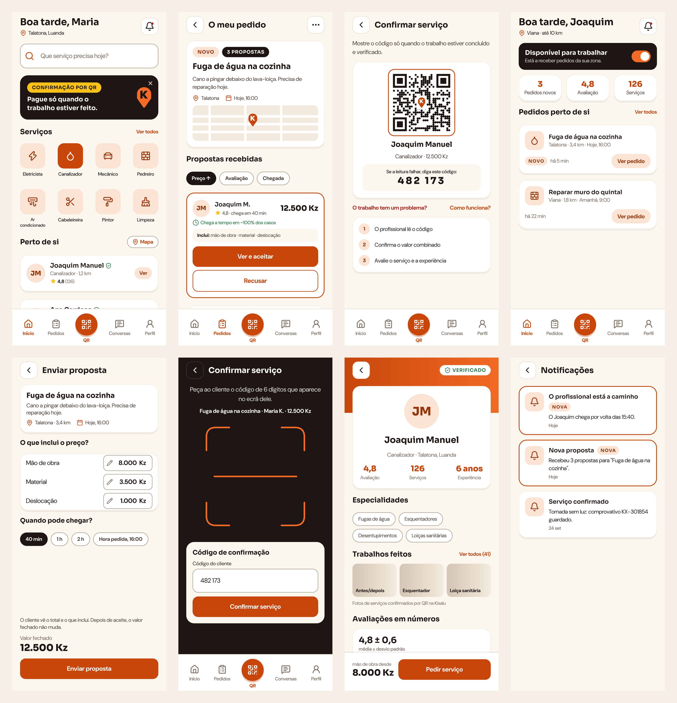

<p align="center"></p>

<p align="center"><b>Quem sabe, resolve.</b></p>

# Kisalu Express

## Documentação

| Documento | Markdown | PDF |
|---|---|---|
| Proposta inicial (1.ª entrega) | [g05-proposta-v1.md](Documentos/g05-proposta-v1.md) | [g05-proposta-v1.pdf](Documentos/g05-proposta-v1.pdf) |
| Segunda proposta (2.ª entrega) | [g05-proposta-v2.md](Documentos/g05-proposta-v2.md) | [g05-proposta-v2.pdf](Documentos/g05-proposta-v2.pdf) |
| Relatório intermédio (2.ª entrega) | [g05-relatorio-intermedio.md](Documentos/g05-relatorio-intermedio.md) | [g05-relatorio-intermedio.pdf](Documentos/g05-relatorio-intermedio.pdf) |
| Relatório de Base de Dados – BD Report (2.ª entrega) | [g05-bd-report.md](Documentos/g05-bd-report.md) | [g05-bd-report.pdf](Documentos/g05-bd-report.pdf) |
| Relatório final (3.ª entrega) | – | – |
| Mobile App Style Guide | – | [g05-mobile-style-guide.pdf](Documentos/g05-mobile-style-guide.pdf) |

**Memória e arquivo documental:** [Kisalu_Express/](Kisalu_Express)
· [Identificação (info.md)](Kisalu_Express/00_Identificacao/info.md)
· [Memória descritiva](Kisalu_Express/01_Memoria_Descritiva/memoria.md)
· [Imagens](Kisalu_Express/02_Imagens/legendas.md)
· [Documentação técnica](Kisalu_Express/04_Documentacao_Tecnica/README.md)
· [Testes e QA](Kisalu_Express/06_Dados_Investigacao/testes-qa.md)
· [Artefactos](Kisalu_Express/05_Artefactos/README.md)

**Gestão do projeto:** [GitHub Projects – Kisalu Express](https://github.com/orgs/Eng-Infomatica-IADE/projects/1)

**Protótipo:** [Figma – Kisalu Express Mockups (G05)](https://www.figma.com/design/y6x5pO2mwQpoiF5ep18mSl/Kisalu-Express-%E2%80%94-Mockups--G05-?node-id=68-2) (ficheiro `y6x5pO2mwQpoiF5ep18mSl`, com o frame v3.1)

## Repositórios

| Repositório | Conteúdo |
|---|---|
| [Kisalu-Express](https://github.com/Eng-Infomatica-IADE/Kisalu-Express) (este) | Documentação, entregas e cópia dos artefactos em `Kisalu_Express/05_Artefactos` |
| [kissalu-app](https://github.com/Eng-Infomatica-IADE/kissalu-app) | Front-end Flutter (código em `app/`) |
| [kisalu-api](https://github.com/Eng-Infomatica-IADE/kisalu-api) | Back-end Node.js e scripts SQL |

## Estrutura de `Kisalu_Express/05_Artefactos`

```
05_Artefactos/
  Aplicacao_Movel/    app Flutter/Dart
  Backend/            API REST (Node.js, Express 5, TypeScript)
  Base_Dados/         create.sql, populate.sql, queries.sql
  Apresentacoes/      slides de cada apresentação
  identidade-visual/  brand book, logótipos e ícones
```

Estrutura completa de `Kisalu_Express/`:

```
Kisalu_Express/
  00_Identificacao/           info.md (metadados e resumo curto)
  01_Memoria_Descritiva/      memoria.md (secções a a f)
  02_Imagens/                 img_01 a img_54 e legendas.md
  03_Videos/                  demonstracao.mp4 e apresentacao.mp4 (3.ª entrega)
  04_Documentacao_Tecnica/    arquitetura, API, dados, matemática, ecrãs
  05_Artefactos/              código, SQL, apresentações, identidade visual
  06_Dados_Investigacao/      questionário, mercado, avaliação heurística, testes e QA
  07_Autorizacoes/            autorizações e consentimentos
```

Instruções para correr cada parte em [05_Artefactos/README.md](Kisalu_Express/05_Artefactos/README.md).

## Sobre o projeto

Marketplace móvel que liga clientes a prestadores de serviços informais (biscateiros: eletricistas, canalizadores, mecânicos, pedreiros, técnicos de AC, cabeleireiras, etc.) em Angola, com perfis de cliente e biscateiro, pedidos, propostas, avaliações, localização e confirmação de serviço por QR Code.

**Projeto Multidisciplinar Mobile** · Licenciatura em Engenharia Informática · Universidade Europeia / IADE · 2026/2027 · Grupo 05

| Elemento | Número |
|---|---|
| Álvaro da Silva | 20252049 |
| Adilson Yango | 20252312 |
| Milton Malavo | 20252099 |

## Estado

**2.ª entrega: protótipo alfa com servidor, base de dados e app a funcionar em conjunto.**

- **App Flutter (v3):** 30 ecrãs e folhas documentados, do lado do cliente e do prestador (ecrãs 11 a 22), ligados à API real. 703 testes automáticos.
- **API REST** (Node.js, Express 5, TypeScript): 82 endpoints documentados em formato bocoup e no Swagger. 83 testes automáticos.
- **Base de dados** MySQL 8 em Docker, com `create`, `populate` e `queries` separados, triggers e vistas.
- **QA ponta a ponta** contra a API real: 154 verificações, 0 falhas. O teste encontrou e corrigiu falhas (avaliar, confirmação com dois serviços ativos, recusar e editar pedidos, sessão guardada, validação do telemóvel angolano, documentos de identidade privados). Detalhe em [testes-qa.md](Kisalu_Express/06_Dados_Investigacao/testes-qa.md).
- **Matemática Discreta:** estatística das avaliações (média, mediana, desvio padrão, intervalo de confiança, média bayesiana) e simulação de Monte Carlo da probabilidade de chegar a tempo. Ver [matematica.md](Kisalu_Express/04_Documentacao_Tecnica/matematica.md).
- **Em falta para a 3.ª entrega:** leitor de QR Code com a câmara, captura de documento, notificações push, GPS, favoritos, manual de utilizador, póster, vídeos e app instalada num telemóvel.

Planeamento no [GitHub Projects](https://github.com/orgs/Eng-Infomatica-IADE/projects/1) (26 concluídas, 7 em curso, 11 por fazer). Documentação técnica em [Kisalu_Express/04_Documentacao_Tecnica](Kisalu_Express/04_Documentacao_Tecnica/README.md).

## Mockups



## Tecnologias

Flutter / Dart · Node.js, Express 5 e TypeScript (API REST) · MySQL 8 · Docker Compose · Vitest e flutter test · Figma · GitHub Projects
